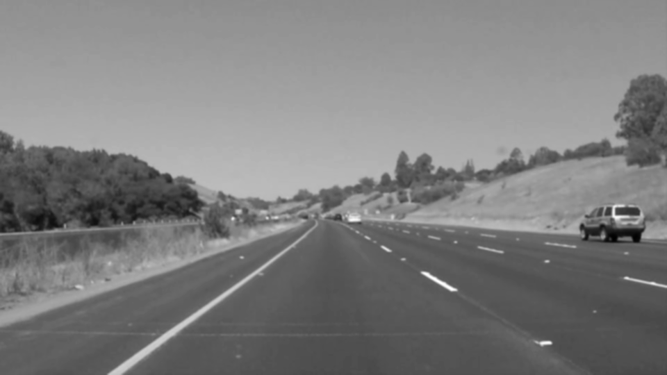
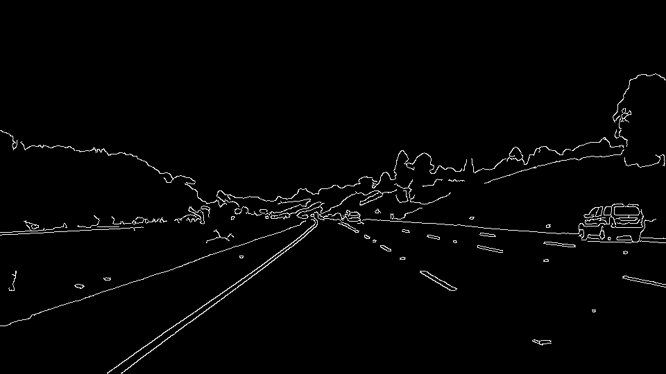
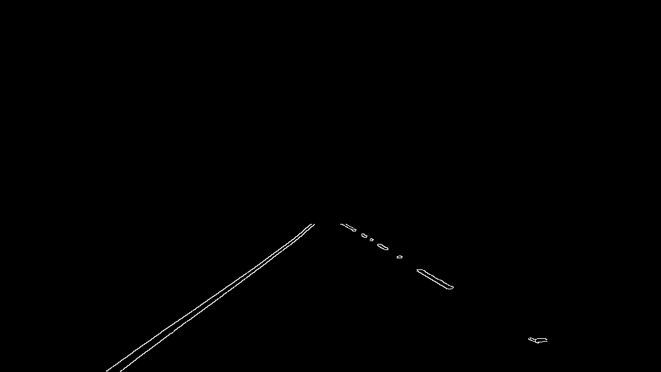
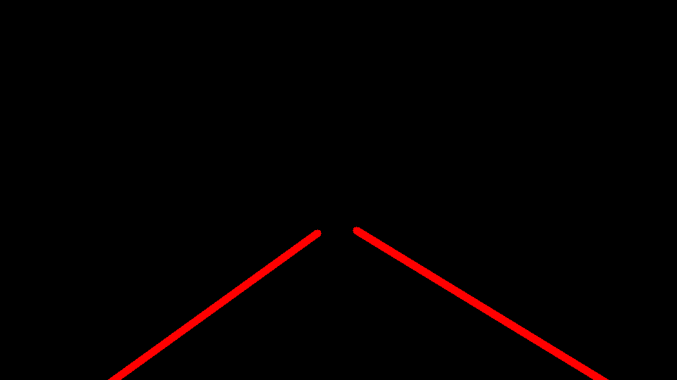
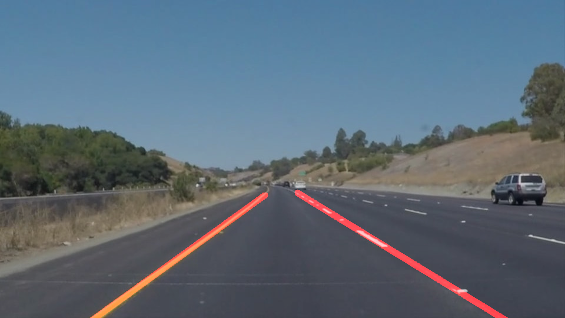

# **Finding Lane Lines on the Road**
---

The goals / steps of this project are the following:
1. Make a pipeline that finds lane lines on the road
2.Reflect on your work in a written report
---

### Reflection

## 1. Describe your pipeline.

My pipeline consisted of seven steps:
#### 1. Read in the original image
This was the easiest part. Aside from importing all of the libraries, reading in an image was quite easy to accomplish.

#### 2. Grayscale the image
Before applying any of other transformations, the image must be gray-scaled to make it easier for Canny edge detection to be able to find gradients between areas of dark and light pixels. Since the pixel value only range from 0 to 255 for a grayscaled image, this makes it a bit easier to detect edges.

#### 3. Apply a Gaussian blur
To reduce noise in the picture we apply a blur that allows nearby pixels to blend in together and facilitate the Canny edge algorithm. Blurring smooths out the edges and consolidates what might have been patches of pixels into something that is more representative of a lane marking.

#### 4. Apply Canny Edge detection
Next we used the OpenCV Canny Edge detection algorithm to find the edges, that is where the pixels are changing the fastest from a dark to light.

#### 5. Apply a Region Mask
We only really car about a specific region of that road and that's the part that's right in front of the car. The region mask is **very** useful since it removes extra edges that would otherwise hurt the performance of subsequent steps in the pipeline. Having made many mistakes along the way, this one in particular bit me the hardest. Initially I was applying the region mask only **after** edge detection and the Hough transform and this resulted in a very badly extrapolated line since there was a lot of noise and that was messing up the line fitting. Having a good mask allows the lines to be split easily into left and right alter down the road.

#### 6. Apply the Hough transform
This is by far the most interesting and (trickiest to some extent) of the project. The idea here is to first make sure that the previous steps are working correctly. Tuning the parameters on the edge detector as well as the Hough transform itself is crucially to be able to fix a good line. As I mentioned before, applying the region of interest mask before any subsequent steps gives a very good slate to work on, since only the most important pixels are visible. To make the `draw_lines` function work, I first separated the lines out by their slopes. This was another blocker initially because the images are displayed in a different plane than the Cartesian that we're most used to. After some sketching and research, I was finally able to realize that the left lane, which has a positive slope in the Cartesian plane, actually has a negative slope in the image coordinate space. And similarly, the right lane, which has a negative slope in the Cartesian plane, actually has a positive slope in the image space. Here's the intuition behind that (easily seen if you were to plot the lines):
  1. For the **left lane**, as x increases, y decreases. Thus, the slope is negative.
  2. For the **right lane**, as x increases, y increases as well. Thus the slope is positive.

After separating the lines based on their slope, I used numpy's `np.polyfit` to fit a line that runs through all of the `(x, y)` pairs in the respective lines. This gave me a slope and intercept and that only thing left to do was to pick some x coordinates and use the slope and intercept to plot the new line, which passes through the most of the points. 

#### 7. Apply Final Mask
When we overlay the final Hough transform over the original image, we get the result that we are looking for.

## 2. Identify potential shortcomings with your current pipeline
One shortcoming is that the current pipeline completely fails the challenge video. Although I have not attempted to try it, converting to a different color space like HSL seems to be an avenue to investigate.

Another shortcoming is that lane lines are almost never completely straight. Due to lens curvature and perspective shift, the top parts of the lane are slightly curved and a linear approximation of the line doesn't do complete justice to the lane.

## 3. Suggest possible improvements to your pipeline
A possible improvement would be to make the code more robust in terms of being able to run the same transformation multiple times. To make the pipeline more robust, like I mentioned before, it would be useful to convert from an RGB space to something like HSL.
